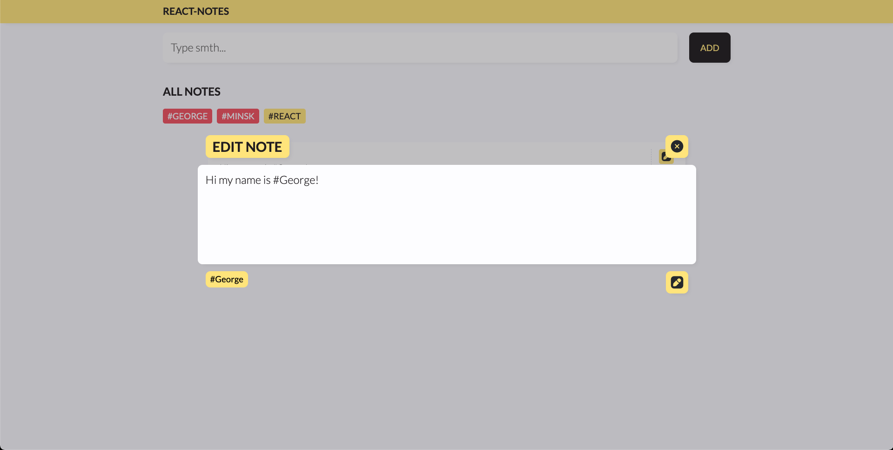

# React-Notes by thisShandy

This is the test react.js project for the Junior Front-End developer
If you wanna start it, you need to download it and:

Install packages: `npm install`
 
 
Start project: `npm start` or `yarn start`

## Screens

Follow me in social media:
 
**_- Instagram: https://www.instagram.com/dark.shandy/_**
 
**_- LinkedIn: https://www.linkedin.com/in/this-shandy/_**
